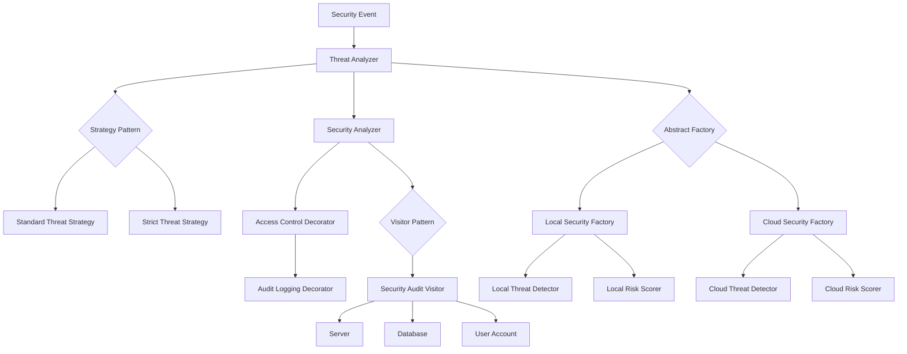

# Unit 12 – Cybersecurity Architecture and Design Patterns

## Architecture Overview

The following diagram shows how the Unit 12 design-pattern artefacts can be viewed as components of a modular cybersecurity analysis system.

## Design Rationale

The architecture separates responsibilities rather than placing threat scoring, security controls, auditing and service creation inside one large class.

**Strategy** encapsulates alternative threat-scoring algorithms and allows the scoring behaviour to change at runtime.

**Decorator** adds cross-cutting security behaviour such as access control and audit logging without modifying the core analyzer.

**Visitor** separates security-audit operations from the system assets being inspected.

**Abstract Factory** separates the platform from concrete families of local or cloud security services, supporting provider substitution.

Together, the patterns illustrate different forms of flexibility rather than using multiple patterns to solve the same problem.

## Architectural Trade-offs

The design improves separation of concerns and makes individual behaviours independently testable. It also reduces direct dependencies on concrete implementations.

However, combining several patterns increases the number of abstractions and classes in the system. This would not automatically be justified in a small application. Pattern selection should therefore respond to genuine variation points: changing algorithms for Strategy, optional behaviour for Decorator, stable object structures with changing operations for Visitor, and interchangeable product families for Abstract Factory.

The architecture is a conceptual integration of the individual portfolio artefacts rather than a claim that they form a production-ready cybersecurity or AI platform.